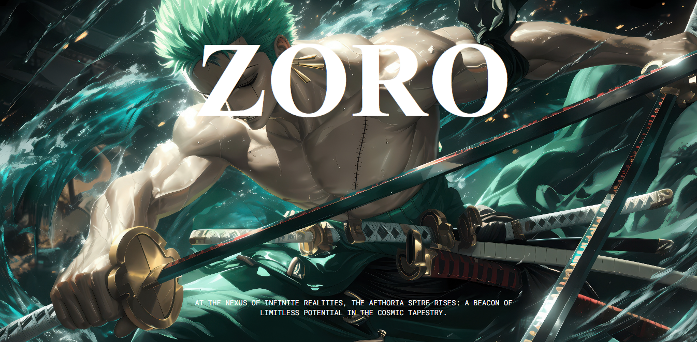

<div align="center">
  <br />
    <a href="#" target="_blank">
      
    </a>
  <br />

  # 💻 Tech Stack:
  .

  <h3 align="center">Roronoa Zoro</h3>

   <div align="center">
     Subscribe my youtube channel <a href="http://www.youtube.com/@WebKaizenDev" target="_blank"><b>webkaizen</b></a> !
    </div>
</div>


## 🖥 Local Setup

To run this project locally, follow these steps:
```bash
# Clone the repository
git clone https://github.com/princekumar-dev74/Roronoa-Zoro.git

# Navigate into the folder
cd Roronoa-Zoro

# Start the development server
run index.html
```
---

## 🔗 Social Media

Follow me for more emotional surprise websites and creative dev content:

- Instagram: [@webkaizen](https://instagram.com/webkaizen)
- YouTube: [@webkaizen](https://www.youtube.com/@WebKaizenDev)
- Telegram: [@webkaizen](https://t.me/web_kaizen_official)
- Shop: [Shop](https://princekumar-dev74.github.io/WEBKAIZEN-SHOP/)
